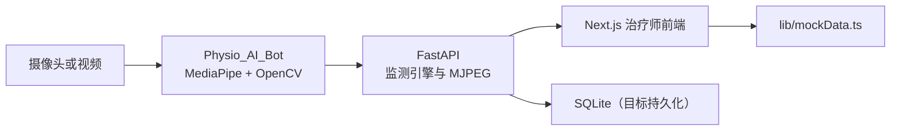
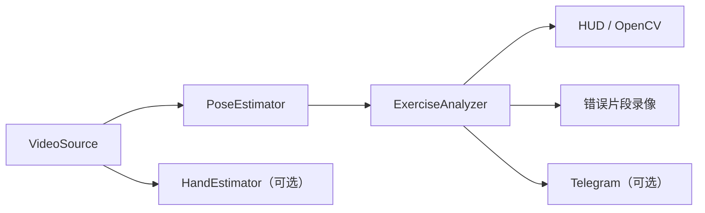
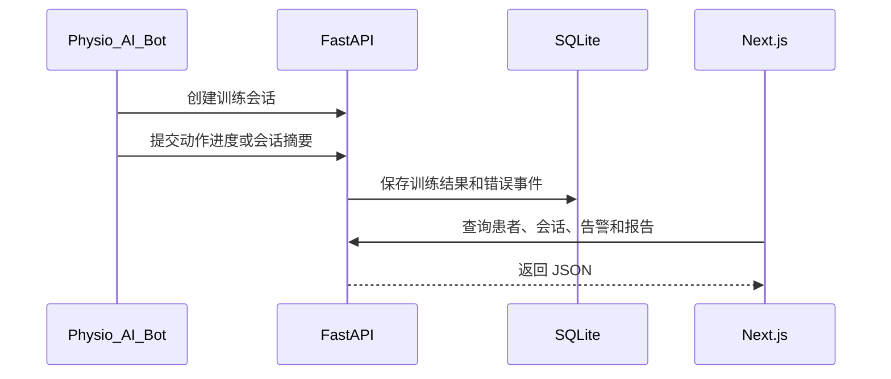

# PhysioVision 当前架构

**状态：核心功能实施基线**

本文描述仓库当前实际结构和近期实现边界。复杂的云端、医院系统和多 Agent 方案暂不作为核心依赖。

## 1. 当前组成



实时摄像头和上传视频分析已经接通。患者、报告等常规业务页面仍使用
Mock 数据，数据库业务闭环尚待完成。

## 2. 前端

前端原型保持现状，不进行视觉和页面结构重做。

```text
app/
├── (public)/
│   ├── page.tsx              /
│   ├── login/page.tsx        /login
│   └── register/page.tsx     /register
└── (app)/
    ├── dashboard/page.tsx    /dashboard
    ├── patients/page.tsx     /patients
    ├── exercises/page.tsx    /exercises
    ├── reports/page.tsx      /reports
    └── settings/page.tsx     /settings
```

患者、报告等数据目前来自 `lib/mockData.ts`。Live Session Monitor 已调用
FastAPI。后续业务集成应通过独立的数据访问层逐页替换 Mock。

## 3. 后端

FastAPI 入口为 `backend/main.py`。

```text
backend/app/
├── api/v1/endpoints/    HTTP 接口
├── models/              SQLAlchemy 数据模型
├── schemas/             请求和响应结构
├── services/            业务逻辑
├── agents/              规则分析原型
└── core/                配置、数据库、安全
```

当前已有患者、训练项目、会话、报告、告警、分析和诊所路由。部分 service、鉴权和 Agent 仍是占位实现；数据库自动建表也尚未启用。

核心后端只需要承担：

1. 患者和训练项目管理。
2. 接收本地监测程序产生的会话摘要。
3. 保存动作次数、质量状态、错误事件和录像引用。
4. 向前端提供查询接口。

## 4. 动作监测程序

`Physio_AI_Bot` 是本地 Python 程序：



目前支持弯举、深蹲、平板支撑和俯卧撑。它不依赖后端即可运行。

## 5. 最小集成数据流



当前实时画面使用 MJPEG，因为它能直接传输 Bot 完成 HUD 绘制后的同一张
OpenCV 帧，适合单机或局域网原型。状态通过低频 REST 轮询获取。需要公网、
音频或多路低延迟视频时再升级为 WebRTC。

## 6. 暂不纳入核心范围

以下能力保留为未来选项，不应阻塞核心闭环：

- Redis Pub/Sub
- MinIO 或 S3
- PostgreSQL
- LangGraph 和外部大模型
- YOLO、ByteTrack 和多目标追踪
- Raspberry Pi 边缘节点集群
- FHIR、HL7 和医院 EMR 对接
- Kubernetes 或复杂云部署

错误视频初期可存放在本地 `clips/`，数据库使用 SQLite，分析优先采用现有确定性规则。

## 7. 完成标准

核心版本完成时应满足：

1. Bot 可以完成一种或多种训练动作分析。
2. Bot 能将会话结果可靠提交给 FastAPI。
3. FastAPI 能持久化并查询会话结果。
4. 现有前端页面能够显示真实患者、会话和告警数据。
5. 断开 Telegram 或外部 AI 服务时，核心训练流程仍可运行。
